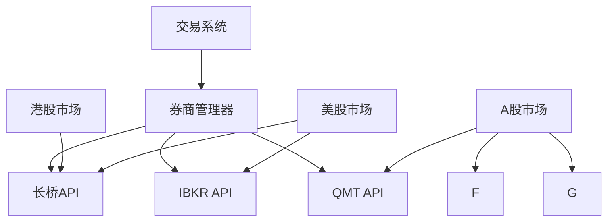

# 智能交易系统 v2.0

一个支持多券商API的智能交易系统，具备标的筛选、自动交易、回测分析和GUI界面功能。

## 🚀 新特性

### 多券商API支持
- **长桥证券**: 支持港股、美股交易
- **Interactive Brokers (IBKR)**: 支持全球市场交易  
- **QMT**: 支持A股量化交易

### 智能券商选择
- 自动根据市场选择最优券商
- 支持券商故障自动切换
- 统一的多券商账户管理

### 现代化GUI界面
- 直观的仪表盘界面
- 实时系统状态监控
- 图形化交易操作
- 多标签页管理

## 📋 功能特性

### 核心功能
- **标的筛选**: 非交易时段自动筛选全市场标的
- **自动交易**: 交易时段基于策略信号执行交易
- **回测分析**: 历史数据回测和策略优化
- **风险管理**: 多层次风险控制和仓位管理

### 市场支持
- **A股市场**: 股票、ETF
- **港股市场**: 股票、ETF、窝轮、牛熊证  
- **美股市场**: 股票、ETF、期权

### 技术特性
- 模块化架构，高可扩展性
- 支持实时数据和历史数据
- 多种技术指标和策略模板
- 完整的日志和错误处理

## 🛠 安装指南

### 环境要求
- Python 3.8+
- Windows/Linux/macOS

### 安装步骤

1. **克隆项目**
```bash
git clone https://github.com/HUSTJJD/TradeFlow.git
cd trading-system
```

2. **安装依赖**
```bash
pip install -r requirements.txt
```

3. **配置券商API**
编辑 `config.yaml` 文件，配置各券商API参数：

```yaml
brokers:
  longport:
    enabled: true
    app_key: "your_app_key"
    app_secret: "your_app_secret"
    access_token: "your_access_token"
  
  ibkr:
    enabled: true  
    host: "127.0.0.1"
    port: 7497
    client_id: 1
```

4. **验证配置**
```bash
python main.py --validate-config
```

## 🎮 使用指南

### 图形界面模式（推荐）
```bash
python main.py --mode gui
```

### 命令行模式
```bash
# 运行标的筛选
python main.py --mode cli --screening

# 运行交易模式  
python main.py --mode cli --trading

# 显示券商状态
python main.py --mode cli --broker-status
```

### 后台服务模式
```bash
python main.py --mode daemon
```

## 📊 系统架构

### 模块结构
```
modules/
├── broker_apis/          # 多券商API抽象层
│   ├── broker_interface.py
│   ├── broker_factory.py
│   ├── broker_manager.py
│   └── brokers/          # 具体券商实现
├── config/               # 配置管理
├── gui/                  # GUI界面
├── market_data/          # 市场数据
├── product_types/        # 产品类型
├── screening_strategies/ # 筛选策略
├── trading_execution/    # 交易执行
├── backtesting/          # 回测分析
└── utils/                # 工具函数
```

### 券商API架构


## ⚙️ 配置说明

### 主要配置项

**券商配置** (`brokers` section):
- `enabled`: 是否启用该券商
- API认证参数（各券商不同）
- 手续费率配置
- 支持的功能特性

**市场映射** (`market_broker_mapping`):
```yaml
market_broker_mapping:
  HK: "longport"    # 港股→长桥
  US: "ibkr"        # 美股→IBKR  
  CN: "qmt"         # A股→QMT
```

**交易策略** (`trading` section):
- 仓位管理参数
- 风险控制规则
- 交易频率限制

## 🔧 开发指南

### 添加新券商

1. 在 `modules/broker_apis/brokers/` 创建新的券商类
2. 实现 `BrokerInterface` 接口
3. 在 `BrokerFactory` 中注册新券商
4. 更新配置文件模板

### 示例：添加新券商
```python
# modules/broker_apis/brokers/new_broker.py
from ..broker_interface import BrokerInterface

class NewBroker(BrokerInterface):
    def connect(self):
        # 实现连接逻辑
        pass
    
    def submit_order(self, symbol, side, order_type, quantity, price):
        # 实现下单逻辑
        pass
```

### 扩展GUI界面

GUI界面使用Tkinter构建，支持自定义组件：

```python
# modules/gui/new_panel.py
import tkinter as tk
from tkinter import ttk

class NewPanel(ttk.Frame):
    def __init__(self, parent):
        super().__init__(parent)
        self._create_widgets()
    
    def _create_widgets(self):
        # 创建界面组件
        pass
```

## 📈 性能优化

### 数据缓存
- 实时数据本地缓存
- 历史数据批量预加载
- 智能数据更新策略

### 并发处理
- 多线程数据获取
- 异步订单处理
- 连接池管理

### 内存管理
- 大数据分块处理
- 自动内存清理
- 性能监控告警

## 🐛 故障排除

### 常见问题

**券商连接失败**
- 检查网络连接
- 验证API密钥
- 确认交易时间

**数据获取异常**
- 检查数据源可用性
- 验证API频率限制
- 查看错误日志

**交易执行错误**
- 检查账户余额
- 验证订单参数
- 确认市场状态

### 日志查看
系统日志保存在 `trading_system.log`：
```bash
tail -f trading_system.log
```

## 🤝 贡献指南

欢迎提交Issue和Pull Request！

### 开发流程
1. Fork本项目
2. 创建特性分支
3. 提交代码变更
4. 创建Pull Request

### 代码规范
- 遵循PEP 8规范
- 添加类型注解
- 编写单元测试
- 更新文档

## 📄 许可证

本项目采用MIT许可证，详见LICENSE文件。

## 📞 联系方式

- 项目主页: https://github.com/HUSTJJD/TradeFlow
- 问题反馈: https://github.com/HUSTJJD/TradeFlow/issues
- 邮箱: your-email@example.com

---

**免责声明**: 本系统仅供学习和研究使用，实际交易请谨慎评估风险。作者不对任何投资损失负责。